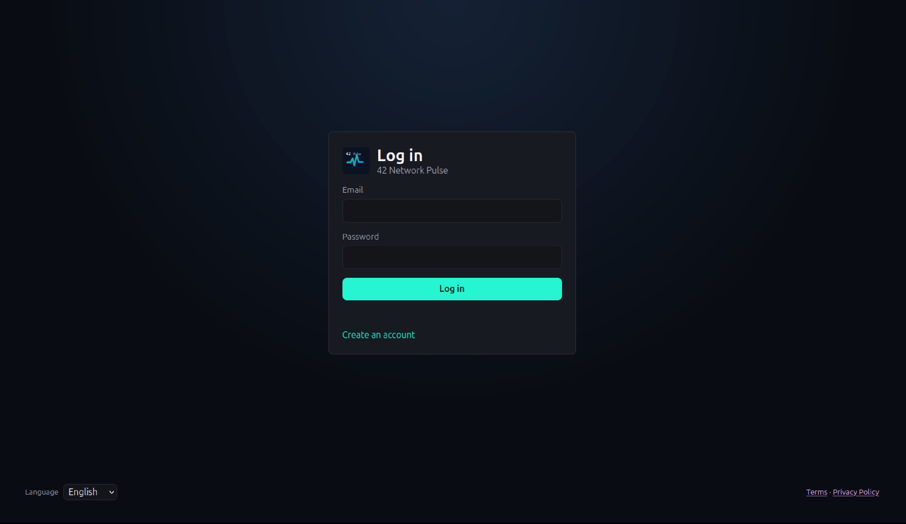
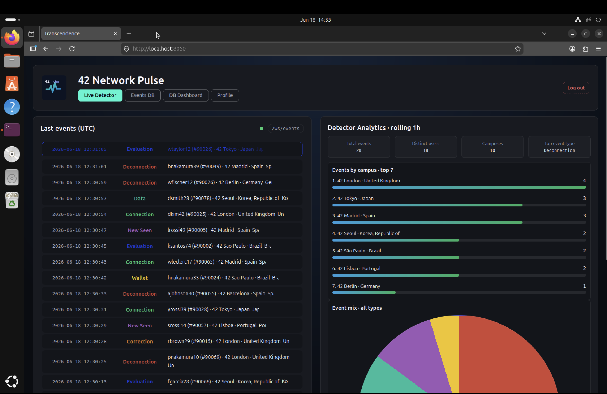
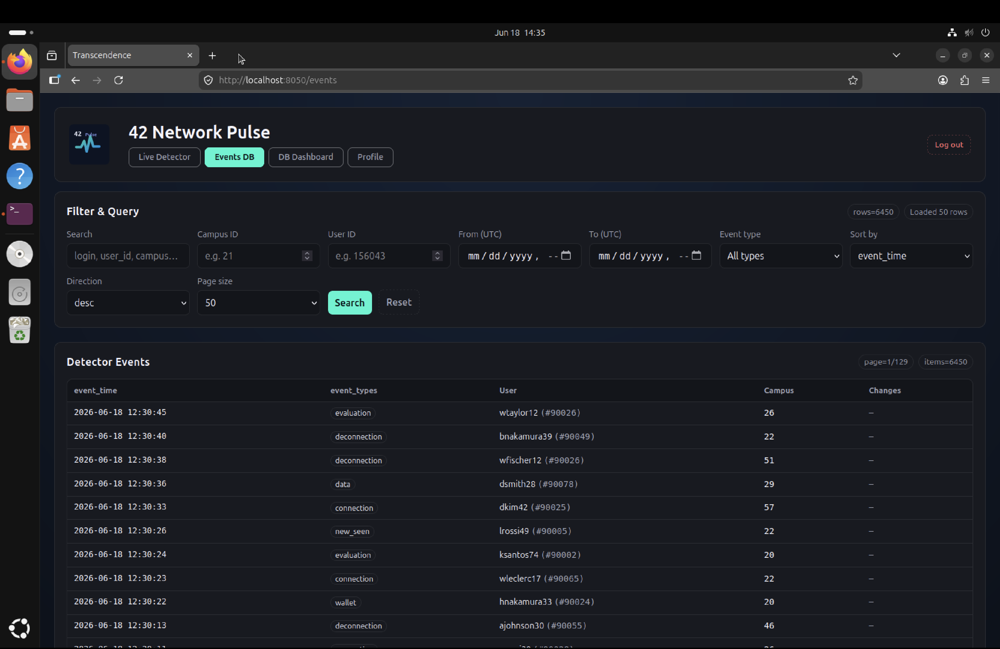
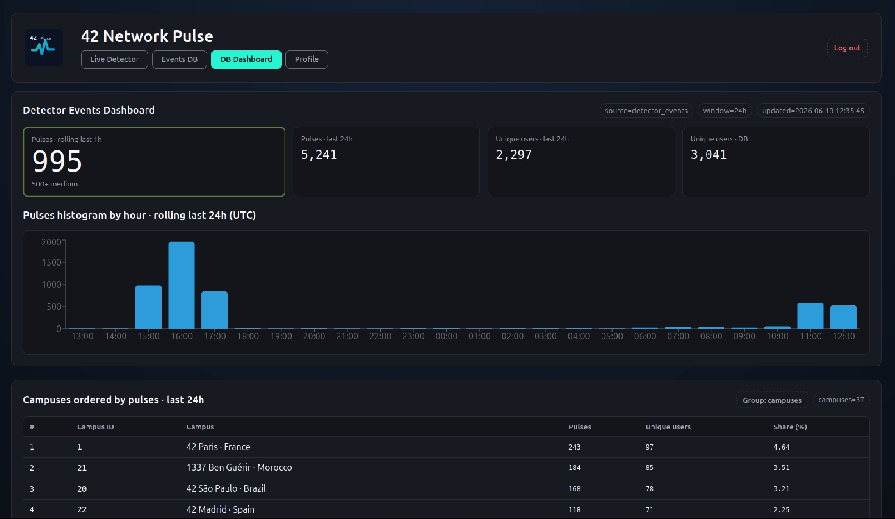
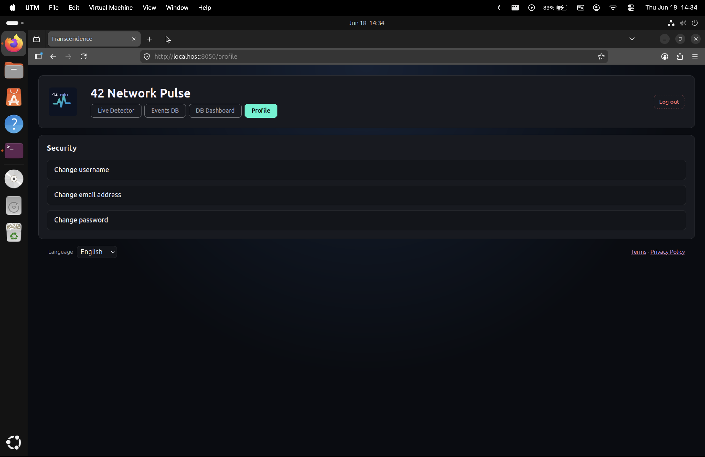
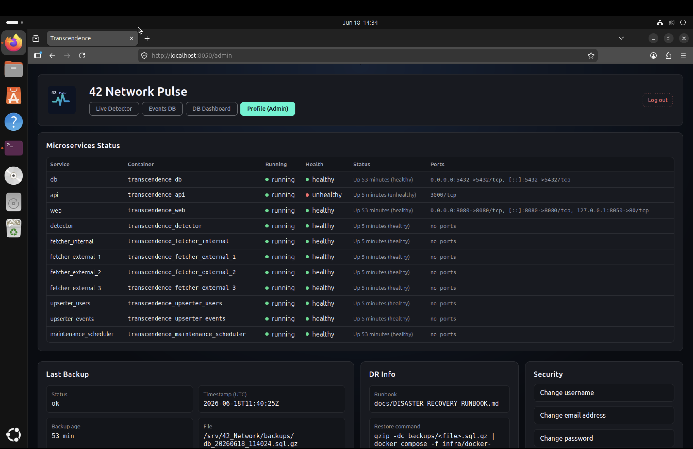

# 42-Pulse

42 Pulse is a full-stack network monitoring platform built from zero as the final team project of 42 Belgium's common core. Lightweight C++ agents collect live data and stream it through a Node.js/Express REST API into a React/Vite dashboard, with WebSocket feeds pushing real-time updates to the browser. The whole stack — frontend, API, PostgreSQL, and an NGINX reverse proxy with SSL and OAuth2 authentication against the 42 Intra API — ships as a multi-service Docker Compose setup that deploys with a single command.
Built with no starter code and validated through structured peer review: every architectural decision in here had to be explained and defended line by line.

## Screenshots

| Login | Live Detector |
|---|---|
|  |  |

| Events DB | DB Dashboard |
|---|---|
|  |  |

| Profile | Admin Panel |
|---|---|
|  |  |

It includes:
- A React/Vite frontend (`frontend/`)
- API ingestion agents for 42 API v2
- PostgreSQL schema and loaders
- Docker services (Postgres, Nginx, API, agents)
- Queue-based live user sync workers
- Operational one-shot tooling (`orchestration-agent`, `ops-agent`)
- In-progress security modules: OAuth/WAF gateway (`security_gateway/`) and the
  IV.5 Cybersecurity module (`security_iv5/`, ModSecurity + Vault)

## Workspace Layout

```text
/srv/42_Network
├── .env
├── transcendance.config
├── backups/
├── data/
│   └── postgres/
├── runtime/
│   ├── exports/
│   ├── logs/
│   ├── backlog/
│   └── cache/
└── repo/                     # git project to push remotely
    ├── app/
    │   ├── api/
    │   ├── detector/
    │   ├── fetcher/
    │   ├── maintenance-scheduler/
    │   ├── upserter/
    │   └── web/
    ├── tools/
    │   ├── api42-client/
    │   ├── token-manager/
    │   ├── ops/
    │   └── orchestra/
    ├── frontend/
    ├── third_party/
    │   └── nlohmann/
    ├── infra/
    │   └── docker-compose.yml
    ├── sql/
    │   └── schema.sql
    ├── security_gateway/
    ├── security_iv5/
    ├── scripts/
    ├── docs/
    ├── tests/
    └── Makefile
```

## Quick Start

### 1. Prepare environment

```bash
cd /srv/42_Network
cp repo/.env.example .env
cp repo/transcendance.config.example transcendance.config
```

Edit `.env` (API/OAuth only) and set at least:
- `CLIENT_ID`
- `CLIENT_SECRET`
- `REDIRECT_URI`
- `SCOPE`

Do not put `ACCESS_TOKEN` or `REFRESH_TOKEN` in `.env`; tokens are stored only in `repo/.oauth_state`.

Edit `transcendance.config` for runtime/deploy settings:
- `CAMPUS_ID`
- `DB_HOST`
- `DB_PORT`
- `DB_NAME`
- `DB_USER`
- `DB_PASSWORD`
- `DB_DATA_DIR` (host path for PostgreSQL data, default `../data/postgres`)
- `WEB_PORT` (optional)
- `DOCKER_GID` (optional; auto-detected from `/var/run/docker.sock` when omitted or stale)

### 2. Bootstrap OAuth state (`repo/.oauth_state`)

Get an OAuth authorization code using your 42 application, then exchange it:

```bash
cd /srv/42_Network/repo
make exchange CODE="<AUTHORIZATION_CODE>"
```

Check token metadata:

```bash
../runtime/cache/bin/token-manager-agent token-info
```

### 3. Deploy stack

```bash
cd /srv/42_Network/repo
make deploy
```

`make deploy` normalizes the PostgreSQL bind-mount owner to container UID/GID `999:999`
before starting `postgres:16`, so differing host user/group names do not break reuse of
`data/postgres`.
It also applies `sql/schema.sql` during `make up-db`, before the app/upserter containers
start, so fresh databases do not fail on missing relations such as `project_users`.
Deploy verifies every table declared in `sql/schema.sql`, not just one sentinel table.

### 4. Verify

```bash
make status
../runtime/cache/bin/ops-agent system_health
../runtime/cache/bin/orchestration-agent check_environment
```

## Daily Operations

Run one-shot bootstrap manually:

```bash
/srv/42_Network/runtime/cache/bin/orchestration-agent orchestra
```

Dry-run bootstrap:

```bash
/srv/42_Network/runtime/cache/bin/orchestration-agent orchestra --dry-run
```

Run environment checks:

```bash
/srv/42_Network/runtime/cache/bin/orchestration-agent check_environment
```

## Main Runtime Commands

```bash
# From /srv/42_Network/repo
make deploy
make status
make logs
make maintenance
make down

../runtime/cache/bin/token-manager-agent refresh
../runtime/cache/bin/orchestration-agent check_environment
../runtime/cache/bin/orchestration-agent orchestra --dry-run
../runtime/cache/bin/ops-agent system_health
../runtime/cache/bin/ops-agent maintenance
```

## Documentation Index

- `docs/DEPLOY_ACTIONS.md`: step-by-step execution flow of `make deploy`
- `docs/AUTOMATED_MAINTENANCE.md`: automated backup/cleanup/health scheduler usage
- `docs/DB_SCHEMA_LIVE.md`: live database schema reference
- `docs/DISASTER_RECOVERY_RUNBOOK.md`: backup/restore procedures
- `docs/MANUAL_OAUTH_EXCHANGE.md`: manual 42 OAuth code exchange steps
- `docs/Mandatory_Checklist.md`: ft_transcendence mandatory requirements checklist
- `docs/selected_modules.md`: chosen ft_transcendence modules
- `docs/transcendance_modules_v21.txt`: module reference notes

## Notes

- This project has been submitted to meet course requirements. While further polishing could be applied, time constraints required us to draw a line and submit at a point we considered sufficiently refined.
- The design was inspired by the 42 Belgium landing page — the same dark gradient background was adopted and the 42 turquoise is used as the accent colour throughout the project.
- Container runtime logic is under `app/*`.
- The frontend (React/Vite) lives in `frontend/`; see `frontend/frontend.md` for build notes.
- CLI/tooling runtime logic is under `tools/*`.
- `security_gateway/` and `security_iv5/` are standalone, not-yet-integrated security modules
  (OAuth/WAF gateway and the IV.5 Cybersecurity module respectively).
- Runtime writable state is outside git in `/srv/42_Network/runtime`.
- Do not use `app/api/node_modules` docs as project documentation sources.

## Authors

This project was developed by:
- drobert
- matsauva
- phiascha
- rceliows